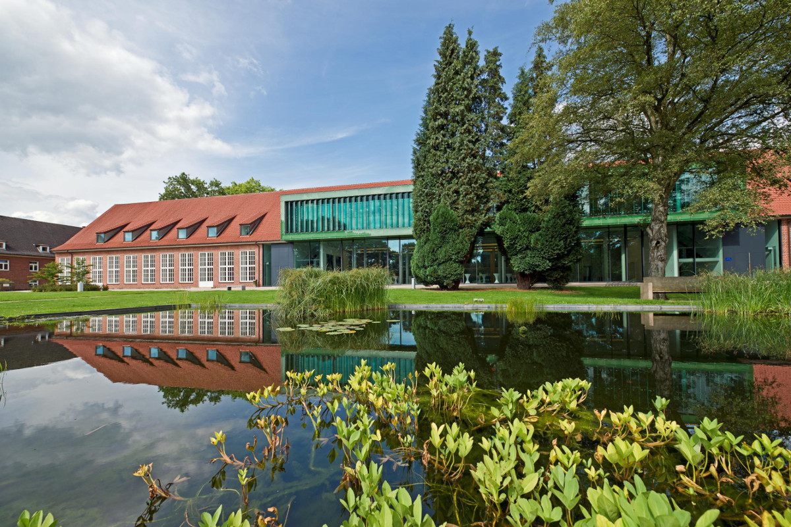

Dynamics Days Europe
====================

**Dynamics Days Europe** is a series of major international conferences founded in the 1980's that provides a European forum for developments in the theory and applications of dynamics. For more than 40 years, it has been bringing together researchers from a wide range of backgrounds including physics, mathematics, biology, and engineering for interdisciplinary research in nonlinear science. 

## Upcoming

[**XLIV Dynamics Days Bremen, Germany**](https://dynamicsdays.eu/bremen2024/)

-    July 29-August 2, 2024
-    On the campus of [Constructor University](https://constructor.university/), Bremen
-    [Local organizing team](https://dynamicsdays.eu/bremen2024/Organizers/)

## Mailing list

- [Subscribe](https://onsager.ugr.es/mailman3/mailman3/lists/dynamics_days.onsager.ugr.es/) to the Dynamics Days Europe mailing list

## Around the world

- Dynamics Days conferences [around the world](https://www.dynamicsdays.info/)  